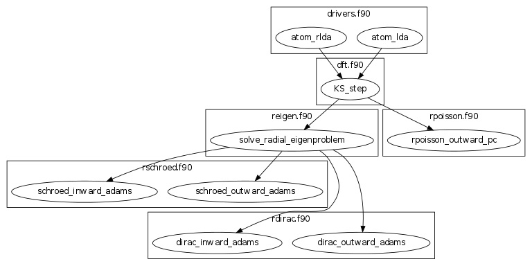

dftatom: Routines for Radial Integration of Dirac, Schrödinger, and Poisson Equations
=====================================================================================

This library implements accurate and efficient radial Schrödinger and Dirac
shooting-method solvers. They work with any grid and any numerical potential.
In addition, it also implements a radial Poisson solver and density functional
theory self-consistency cycle.

Article
-------

Detailed description of methods, convergence and implementation is in the
following article:

Ondřej Čertík, John E. Pask, Jiří Vackář, dftatom: A robust and general
Schrödinger and Dirac solver for atomic structure calculations, Computer
Physics Communications, Volume 184, Issue 7, July 2013, Pages 1777-1791, ISSN
0010-4655,
`10.1016/j.cpc.2013.02.014 <http://dx.doi.org/10.1016/j.cpc.2013.02.014>`_.
Preprint: `arXiv:1209.1752 <http://arxiv.org/abs/1209.1752>`_.

Accuracy
--------

With the provided meshes, the solvers (both Schrödinger and Dirac) can converge
to at least 1e-8 Ha accuracy (with double precision of approximately 16
significant digits) for all eigenvalues and total DFT energies for all atoms up
to Uranium (Z=92).

The converged nonrelativistic and relativistic results agree with NIST
benchmarks to the stated accuracy of those benchmarks (2e-6 Ha in eigenvalues
and 1e-6 Ha in total energies).

http://physics.nist.gov/PhysRefData/DFTdata/Tables/ptable.html

License
-------

This program is MIT licensed, see the LICENSE file for details.

Compilation
-----------

The main code is standard Fortran 95 with no extensions and so can be compiled
with any standard f95 conforming compiler. The optional C interface requires
Fortran 2003 ``iso_c_binding`` module.
N.B.: Due to a bug in older versions of the Intel ifort compiler, ver. 12.0.191
or later is required.

We provide CMake and standard Makefiles. To use the standard Makefiles, do
(from the top directory)::

   make -f Makefile.manual

The provided Makefile.manual uses the gfortran compiler to build the (slow,
extensively checked) debug version of the library. Modify as desired for your
preferred compiler/options (in particular, to build a faster release version;
see comments in Makefile.manual). The optional C and Python interfaces are not
built by default.

To use CMake, do (from the top directory)::

   cmake .
   make

The first command generates the required Makefiles and the second command runs
them. The default build uses your default Fortran compiler to make a debug
version without C or Python interfaces (see below how to enable them
or change other build options or the compiler).

Tests
-----

It's important to check that the routines calculate correctly, before you use
them for any serious calculation. To do that, execute (if you use CMake)::

    $ make test
    [...]
    100% tests passed, 0 tests failed out of 15

    Total Test time (real) = 367.75 sec

or (if you use hand written Makefiles)::

    $ make -f Makefile.manual test
    [...]
    make[2]: Leaving directory `/home/ondrej/repos/dftatom/tests/atom_U'
    make[1]: Leaving directory `/home/ondrej/repos/dftatom/tests'

    All tests passed.

it will take around 6 minutes to run for release compilation (not debug), all
tests should pass (in both cases you should see the summary above saying that
all tests have passed). Here are examples of the output if there is any error
for CMake::

    $ make test
    [...]
    93% tests passed, 1 tests failed out of 15

    Total Test time (real) =   9.36 sec

    The following tests FAILED:
         13 - conv_lda (Failed)
    Errors while running CTest
    make: *** [test] Error 8

and manual Makefiles::

    $ make -f Makefile.manual test
    [...]
    Test failed: error =   8.99E-04   >   5.00E-04 specified.
     Aborting...
    STOP 1
    make[2]: *** [test] Error 1
    make[2]: Leaving directory `/home/ondrej/repos/dftatom/tests/lda'
    make[1]: *** [test] Error 2
    make[1]: Leaving directory `/home/ondrej/repos/dftatom/tests'
    make: *** [test] Error 2

CMake Options (Python and C Bindings, Release Build, Lapack)
------------------------------------------------------------

CMake has many standard options, see ``man cmake``. For example
you can set the compiler by doing (make sure you delete ``CMakeCache.txt`` if
you ran CMake before)::

    FC=ifort cmake .

You can set whether to build ``Debug`` or ``Release`` builds by::

    cmake -DCMAKE_BUILD_TYPE=Release .
    cmake -DCMAKE_BUILD_TYPE=Debug .

The default compiler options that will be used for each build are specified for
gfortran and ifort in ``cmake/UserOverride.cmake`` (for other compilers, the
default CMake options will be used). You can set your own compiler options
for each build by::

    cmake -DCMAKE_Fortran_FLAGS_RELEASE="-O3" .
    cmake -DCMAKE_Fortran_FLAGS_DEBUG="-g" .

Besides the standard options above, we provide several options specific for
dftatom. By default, only Fortran code is compiled. To enable C and Python
bindings, first install Cython and NumPy, for example in Ubuntu 12.04::

    apt-get install cython python-numpy

and then you have to use CMake and set the ``WITH_PYTHON`` CMake variable to
``yes``. You can either do::

    cmake -DWITH_PYTHON=yes .
    make

Alternatively you can also just edit the generated
``CMakeCache.txt`` file (this assumes that you have already run CMake before)
and rerun ``make`` again.

To only enable the C interface (but not Python), set the variable
``WITH_C_INTERFACE`` to ``yes``.

To run Python API tests (to make sure that things got compiled properly and
that the Python module can be imported)::

    $ PYTHONPATH=. dftatom/test_runner
    ============================= test process starts ==============================
    executable:   /home/ondrej/repos/qsnake/local/bin/python  (2.6.4-final-0)

    tests/test_dftatom.py[4] ....                                               [OK]

    =================== tests finished: 4 passed in 1.90 seconds ===================

This will use the ``dftatom`` module from the current directory (that's why we
need to add ``.`` to ``PYTHONPATH`` so that Python can find the module). To
install the module into a different directory, do for example::

    cmake -DWITH_PYTHON=yes -DCMAKE_INSTALL_PREFIX="$HOME/usr" -DPYTHON_INSTALL_PATH="$HOME/usr/lib/python2.7/site-packages" .
    make
    make install

This will install it into ``~/usr``.

The ``double_min`` test depends on Lapack, so it is turned off by default.
You can enable it by::

    cmake -DWITH_LAPACK=yes
    make

You need to have ``lapack`` and ``blas`` libraries. If non-standard linking is
required, modify the link options in the file
``tests/double_min/CMakeLists.txt`` by hand.

Usage
-----

Look into tests how to use the routines to get meaningful results. Run for
example the Uranium LDA::

    cd tests/atom_U
    ./F_atom_U

There are also a few Python examples in the examples/ directory, you can
execute them for example using::

    PYTHONPATH=. python examples/atom_U.py

Read "Structure Of The Program" section below for more information.

Development
-----------

The C bindings are defined in ``c_dftatom.f90``. If you update this file,
make sure you run::

    $ utils/generate
    'src/c_dftatom.h' updated
    'dftatom/lib/c_dftatom.pxd' updated

This will update the C ``.h`` file as well as Cython ``.pxd`` file. Then use it
from C or Cython as usual, typically you probably want to export the new
functionality to Python by updating the ``.pyx`` files and then just::

    make

Structure Of The Program
------------------------

The structure of the Fortran 95 modules is described here. The relations of
the most important subroutines can be summarized in a dependency graph:

The ``drivers`` module contains higher level DFT subroutines ``atom_lda`` and
``atom_rlda`` that one can use to solve atoms. The atomic orbitals (radial
wavefunctions) can be accessed in the argument ``orbitals`` of these functions.
They are given on the radial mesh returned by the argument ``R`` and are
normalized according to the equations (9) and (20) in the manuscript. These
wavefunctions can then be used to construct interaction matrix elements. The
radial density and Kohn-Sham energies are also returned as arguments
``density`` and ``ks_energies``.  Other parameters affecting the results that
can be set are mesh parameters, atomic configuration, accuracy of the
eigenproblem as well as selfconsistency iterations and whether or not to use
the perturbation correction, see the definitions of the subroutines in
``drivers.f90`` for more details. As an example of usage, see for instance the
program ``tests/atom_U/F_atom_U.f90`` which prints the orbitals and energies.

The ``dft`` module contains utilities to solve the Kohn-Sham equations.

The radial Schrödinger/Dirac integration is performed by the ``reigen`` module
using the ``solve_radial_eigenproblem`` subroutine, which accepts the
(external) potential as an argument ``V`` specified as an array of values on a
mesh (argument ``R``).  There are several configuration options that can be
supplied, see the documentation of the ``solve_radial_eigenproblem`` subroutine
in ``reigen.f90``.  Examples of usage are given in the simple tests in
``tests/pseudopotential/`` or ``tests/oscillator/``, where the potential and
mesh is constructed in the main program.

Finally, the low level modules ``rschroed``, ``rdirac`` and ``rpoisson`` handle
the radial integration (they use the ``ode1d`` module that contains some common
utilities for solving ordinary differential equations). Detailed documentation
of these subroutines is given in the comments in the code.

A description of all modules follows:

rschroed.f90
    Routines in this module solve the radial Schroedinger equation outward and
    inward using the implicit Adams method.

rdirac.f90
    Routines in this module solve the radial Dirac equation outward and
    inward using the implicit Adams method.

rpoisson.f90
    Routines in this module solve the radial Poisson equation outward using
    the predictor-corrector method (with Adams extrapolation/interpolation).

ode1d.f90
    General utilities for solving 1D ODEs. the Adams and rk4 subroutines
    are used by Schroedinger, Dirac and Poisson solvers. The integrate
    function is used at other places in dftatom to calculate integrals of the
    radial density/orbitals.

reigen.f90
    Solves the radial Schroedinger/Dirac eigenproblem

mixings.f90
    This module contains SCF mixing algorithms.

mesh.f90
    Contains mesh utilities (creating the exponential mesh and its derivatives).

dft.f90
    Calculates the exchange and correlation potential, Hartree potential,
    and the full (single) Kohn-Sham iteration.

dft_data.f90
    Contains the ``dft_data_t`` type used in the DFT routines.
    This data type stores mesh, potential, atomic configuration, orbitals
    and other parameters of the DFT problem.

states.f90
    This module lists nonrelativistic and relativistic atomic configurations.
    The nonrelativistic configurations are the same as at NIST and are simply
    hardcoded in the subroutine for each atom. The relativistic configuration
    is then calculated from the nonrelativistic by splitting the occupancy
    according to the degeneracy (see the comments in the
    ``get_atomic_states_rel`` subroutine of this module for more technical
    information).

drivers.f90
    This module contains high level drivers for atomic SCF calculations.  The
    idea is to use these drivers to do most frequent calculations with an
    exponential mesh and to get an idea how things work. They can be used as a
    starting point/template to write a custom solver for a particular problem,
    or to use a different mesh.

energies.f90
    Calculates Hydrogen nonrelativistic and relativistic energies (exact),
    Thomas-Fermi (TF) energies (only very approximate), TF potential and charge
    density (very accurate).

dftatom.f90
    This module contains the high level public API (application programming
    interface) for dftatom. One should only be using this module from external
    programs (as long as only the high level functionality is needed). For a low
    level usage, one can always call the individual modules directly.

c_dftatom.f90/.h
    The C API to dftatom that wraps the API exposed by the ``dftatom``
    module and the corresponding C header file.

rschroed_other.f90
    Other Schroedinger integrators, not directly used by dftatom, but available
    for reuse. This module contains various rk4 integrators and Adams
    predictor-corrector integrators (both for outward and inward integration).

rdirac_other.f90
    Other Dirac integrators, not directly used by dftatom, but available for
    reuse. This module contains various Adams predictor-corrector integrators
    (both for outward and inward integration) and functions to calculate
    analytic asymptotic.

rpoisson_other.f90
    Other Poisson integrators, not directly used by dftatom, but available for
    reuse. This module contains various Adams predictor-corrector integrators
    (both for outward and inward integration).

ode1d_other.f90
    General utilities for solving 1D ODEs, not used directly by dftatom. They
    are available here for reuse.

types.f90
    This module defines the ``dp`` double precision type.

constants.f90
    Contains the mathematical constant ``pi``.

utils.f90
    Various utilities for general use in Fortran programs.
